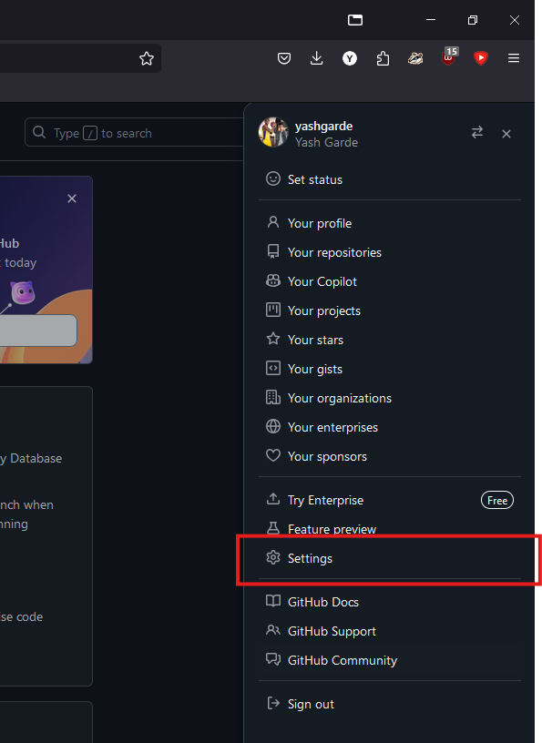
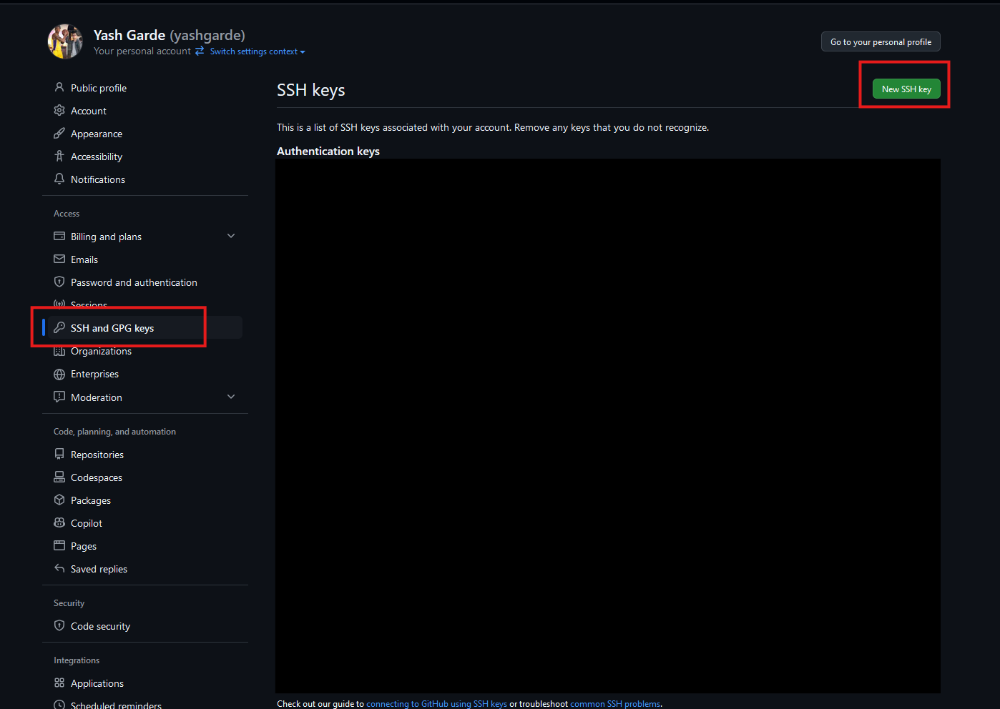
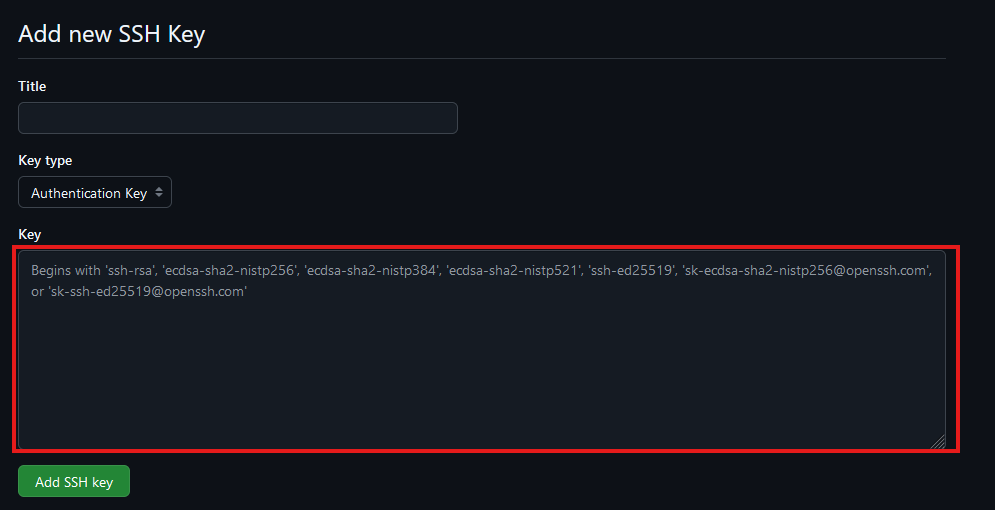

# Part 1: git motivated
**git**: command line program that enables version control (in case you break it)

**Repository**: folder containing code

**GitHub**: website that holds (repos)itories; can contribute and share with others


# Part 2: SSH Keys on GitHub
### Command to get the Github People repo 
`$ git clone git@github.com:Monip1/lab2-people.git`


Recall from last lab how to log into your ieng6 account:

<code>
$ ssh <span class="code-replace-me" contenteditable>yourusername</span>@ieng6.ucsd.edu
</code>

**Please log into ieng6.** Within your ieng6 account, use the following command to generate a new key pair, replacing `github_email` with your **GitHub email address**:

<code>
$ ssh-keygen -t rsa -b 4096 -C <span class="code-replace-me" contenteditable>github_email</span>
</code>

You’ll be prompted to “Enter a file in which to save the key”. Press Enter to accept the default location. You’ll then be prompted to enter a passphrase, which isn’t really necessary. Press Enter twice to continue without setting a passphrase. Though if you really want to set a passphrase, refer to [GitHub docs on passphrases](https://docs.github.com/en/authentication/connecting-to-github-with-ssh/working-with-ssh-key-passphrases).

## Adding your SSH key to GitHub

By default, the public SSH key is saved to a file at `~/.ssh/id_rsa.pub`.

Instead of typing out the whole filename, you can type out some prefix of the name (e.g. `~/.ssh/id`), and **press Tab to autocomplete the name**.
In this case, tab complete won’t complete the full filename, since the private key happens to be named `id_rsa`.
*Please* be too lazy to type out entire filenames and use tab complete instead\!


**View the contents of** `~/.ssh/id_rsa.pub` **(using `cat`)**, then copy the contents of the public key file to your clipboard.

On the GitHub website, click your profile picture in the top right to open a menu, and click on “Settings”.



On the left, open “SSH and GPG keys”, then click on “New SSH key”.



Populate the fields as follows:

* **Title**: “ieng6”
  * The title doesn’t affect the functionality of the key, it’s just a note for you that this key is tied to your ieng6 account.
* **Key type**: “Authentication key”
* **Key**: Paste the contents of the public key file here (entire block including the email portion).



Click “Add SSH key”. You may need to confirm access to your account on GitHub at this point.

### Testing your SSH key

Finally, test your connection to GitHub with the command:

```
$ ssh -T git@github.com
```

If this is your first time connecting to GitHub, you might get a warning about the “authenticity of host can’t be established”. This is a warning for you to make sure that you’re connecting to the right thing. For the purposes of this lab, we assume that GitHub didn’t suddenly get hacked, so you can safely respond with “yes”. But if you’re really paranoid, you can check GitHub’s public key fingerprint [here](https://docs.github.com/en/authentication/keeping-your-account-and-data-secure/githubs-ssh-key-fingerprints).

After a successful connection, it should output `Hi <your-username>! You've successfully authenticated, but GitHub does not provide shell access`.

# Part 3: Whiteboard Activity - UTF-8 Strings
1. ★彡:)
2. ¿Sí?
3. ㅋ😂!
4. Jé😀

# Part 4: Submitting the PA (Lab Work Checkoff)

**PA 1 GitHub Classroom Link:** [https://classroom.github.com/a/pGoD-4Uz](https://classroom.github.com/a/pGoD-4Uz)

To get the 1 point for lab work checkoff this week, you just need to make a submission on Gradescope for `pa1`! 

## Important git commands
### $ git status
Gets the status of our repository. It returns which files are untracked (new) modified (changed) and deleted.

###  $ git add [filename(s)]
When we are done making changes to a file, we "stage" it to mark it as ready to be committed. Using the `git add` command with the path of the changed file(s) will stage each to be included in the next commit. 

### $ git commit -m “message”
A commit is a package of associated changes. Running the `git commit` command will take all of our staged files, and package them into a single commit. We specify the `-m` option to specify we want to write a commit message, and write our commit message in the “”. Without `-m`, git opens a vim window to write the commit message.

### $ git push
Pushes the commit with our changes to the remote repository (i.e. GitHub).

