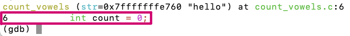

# Lab 4 Reference Document


Part 1: `.vimrc` addendum and ssh `config`
--------------------------------

In the file `~/.vimrc` on ieng6, add:

```
set cindent
```

On Your computer (not ieng6) create the file `~/.ssh/config`:

```
Host <shortcut> <possibly more shortcuts>
    HostName <the host name of the ssh server>
    User <your username on the ssh server>

```

Part 2: GDB Debugging
--------------------------------

### New GDB commands
#### `start`

Sets the program to be run at the beginning of `main`.

#### `break [line number]`

Sets a **breakpoint** at the specified line number. (**Breakpoint**: a line in the program at which GDB will stop at before the line executes.)

#### `next`

Execute the next line of code.

#### `step`

If the next line contains a function call, steps into that function call and stops at its first line. If there is no function call, behaves the same way as `next`.

#### `continue`

Continues to run the program from the next line until the next breakpoint.

The line that is shown above the `(gdb)` prompt *has not run yet*. It is the line that will run if you type `next`.


### Activity

(clone the github classroom repo from here: <https://classroom.github.com/a/iSlIHwXP>)
 
`/home/linux/ieng6/CSE29_FA25_A00/public/`restofpath??


Part 3: Hacking
---------------------

Give yourself an A!  
Here is the source code for reference:


GDB commands that may be useful for this activity:

-   `(gdb) info locals`

-   `(gdb) info args`

-   `(gdb) print VALUE (or p VALUE)` You can print any variable or expression, e.g.

-   `print x`, `p arr[5]`, `p ((x & 0b1111) << 3)`

-   You can also specify a format to print in

-   `print/t` (binary), `print/x` (hex), `print/d` (decimal)

-   `(gdb) x ADDRESS` This prints out memory at an address, e.g. strings / arrays / pointers

-   `(gdb) x/16cb str1` This prints the first 16 bytes of `str1` as characters

-   `(gdb) x/20xb str2` This prints 20 bytes of `str2` in hex

-   `(gdb) x/4dw  arr` This prints 4 "words" (i.e. `int32s`) of `arr`, as decimal numbers

-   You can use the following [reference card](https://darkdust.net/files/GDB%20Cheat%20Sheet.pdf) for reference on gdb commands, and format commands for x and print.

Work Check-off
--------------

To be announced.

