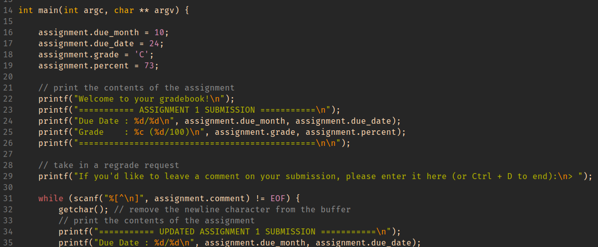

# Lab 4 Reference Document


Part 1: `.vimrc` addendum and ssh `config`
--------------------------------

In the file `~/.vimrc` on ieng6, add:

```
set cindent
```

On Your computer (not ieng6) create the file `~/.ssh/config`:

```
Host <shortcut> <possibly more shortcuts>
    HostName <the host name of the ssh server>
    User <your username on the ssh server>

```

Part 2: GDB Debugging
--------------------------------

(clone the github classroom repo from here: <>)

Debug the buggy `index_of` file.  
`/home/linux/ieng6/CSE29_FA25_A00/public/lab5/afilename??`


Part 3: Hacking
---------------------

Give yourself an A!  
Here is the source code for reference:


Work Check-off
--------------

To be announced.

