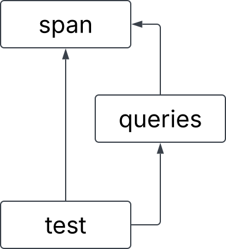

# Lab 6 Reference Document

(clone the GitHub Classroom repo from here: <https://classroom.github.com/a/oTFGxPnL>)

# Part 1: Valgrind

## How to Run `valgrind`
Compile your code, filling in PROGRAM with your actual program name, and ARGS if your program takes any command-line arguments:
```
$ gcc -Wall -g PROGRAM.c -o PROGRAM
```
Then, run the Valgrind command:
```
$ valgrind --leak-check=full ./PROGRAM ARGS
```
We can add the `--leak-check=full` flag to instruct Valgrind to report the locations where leaked memory had been allocated. 

For `search.c`, we could search for `alp`:
```
$ gcc -Wall -g search.c -o search
$ valgrind --leak-check=full ./search alp < alpaca.txt
```

For `student.c`:
```
$ gcc -Wall -g student.c  -o student 
$ valgrind --leak-check=full ./student < students.txt
```

## `time` command
You can add `time` to the beginning of a command to report the actual time it takes for that command to run! i.e.
```
time valgrind ./PROGRAM
```

## Valgrind Memory Errors
Notice how the heap summary gives you information on where each memory error occurs:
- **Definitely lost:** Besides myself, memory leaks are also considered "definitely lost" when the pointer to the memory becomes inaccessible. This can happen when the pointer is deleted when a function ends and its stack frame is deleted, or when the pointer is set to another value.
- **Indirectly lost:** Blocks of memory are considered "indirectly lost" when there exists a pointer in another leaked memory to the block. In this case, the memory pointed to by `pp` (i.e. `*pp`) is definitely lost, and the memory pointed to by `*pp` (i.e. `**pp`) is indirectly lost.
- **Possibly lost:** "Possibly lost" memory leaks occur when we have a pointer to some part of the leaked memory, but not to the base of the memory block, likely because the pointer was modified. In this case, we allocate an array of integers, then move the pointer to point to the middle of the array.
- **Still reachable:** Memory leaks are "still reachable" when the pointer is not lost when program exits, but the memory is still unfreed. This can occur when a global variable contains a pointer to leaked memory.
- **Suppressed:** Users can specify the flag `--suppressions=<filename>` to Valgrind to intentionally ignore leaks that are known to be harmless or unavoidable. If you want to learn how to use this flag, you can check out this [StackOverflow post](https://stackoverflow.com/questions/13692890/suppress-potential-memory-leak-in-valgrind), although in our (at least one tutor and at least one TA) experience this flag is seldom used, if at all.

# Part 2: Header Guards and Makefiles

## Header Guards

```c
#ifndef EXAMPLE_H
#define EXAMPLE_H

struct example {
    char *str;
};

#endif
```

Header guards prevent the content within them from being processed multiple times by the compiler.
This can be problematic if the header file intends to *define* any symbol, not just *declare* them.
In the example above, the header guard ensures that `struct example` is defined at most once.
Let's illustrate the utility of header guards with a concrete example.

After cloning the Github classroom repository onto `ieng6`, `cd` into `2lab6-headers-and-makefiles`. Then `cd` into `headers` and inspect the contents of the five files inside. These files together represent 3 "modules" with the following dependency graph:



When the compiler reads `test.c`, its preprocessor will process `span.h` twice: once through the direct arrow pointing to `span.h` and once through `queries.h`, which also points to `span.h`. As a result, the contents of `span.h` will be "pasted" into the source file twice. Since `span.h` contains a struct *definition* for `struct string_span`, this definition will be repeated twice. Try the following compilation command to see what this causes:

```
$ gcc span.c queries.c test.c -Wall -o test
```

The compiler seems to be confused by the duplicated definition for `struct string_span`, which is the first error it reports. 

**To Do**: Use what you have learned about header guards to fix this compiler error! Please note that by convention, everything in a header file is wrapped in a header guard.


## Makefiles

### Part 2-0: Recipes and Dependencies

**Exit the `headers` directory and enter the `part2-0` directory.** We have given you an example `Makefile` that illustrates its basic structure. A Makefile mostly consists of "rules", which have the form:

```make
target: dependencies
	recipe
```

In a lot of ways, you can think of defining rules in Makefiles like defining functions in C, but there are important differences.

* The *target* could be thought of as the name of the rule. We use the target to tell `make` which rule should be used. Unlike functions, Makefiles expect targets to be the names of files.
* The *dependencies* are files or other targets that the creation of the target depends on. For C programs, these dependencies are usually source code and object files.
* The *recipe* contains the commands that are executed when `make` uses this rule. Recipes can have one or more different commands to be executed sequentially.

Use this explanation to understand the contents of the `Makefile` in `part2-0`. Try running `make` with the `cse100` target to ask Make to build `cse100` along with its dependencies:

```
$ make cse100
```

Pretty cool! It might also be useful to clean out and remove any files that got produced if we want to run `make` again, like all the `cse` files that we just made in this Makefile. We do that using: 

```
$ make clean
```

This will remove all the files that start with `cse`. Now, after running `make clean`, we can run: 
```
$ make cse30
$ make cse100
```
See what files get made at each step! Try out the other targets as well, like `cse12` and `cse29`.

### Part 2-1: Makefile for One

Exit the `part2-0` directory and enter the `part2-1` directory, where we are given a single, very simple source code file `program.c`. You can look at its contents, but there’s nothing there to see (or do).

It’s not necessary to define dependencies, but we often do because Makefile automatically checks if any of its dependencies have changed more recently than the target file. If not (and if the target file already exists), then `make` does not bother to execute the recipe, because the target file must already be up to date. This means that `make` will only execute the recipe if the target file doesn’t exist, or one of its dependencies is more recently updated than the target file.

A typical example of a rule for C is the one below:

```make
program: program.c
	gcc -Wall -g -o program program.c
```

In this rule, the target is `program`, which is the executable file we want to create with this rule. The recipe is a `gcc` command to produce `program`, which you would normally run manually in the terminal. Since we define `program.c` to be a dependency of this rule, this means that `program` will only be recompiled if `program.c` is more recently updated than `program`.

This rule example just so happens to work perfectly for the Makefile we want to write in this section, so fill in your Makefile with this rule. Please note you should create your Makefile, for example, using the command `touch Makefile`.

After writing this rule into the Makefile, you can then run `make` with the target to run the compilation command in the recipe:

```
$ make program
```

Notice that `make` prints out the recipe command, and, if you check the contents of the directory, executes that command to compile `program.c`. Try running `make program` again to see that `make` refuses to recompile `program`, because it’s already up to date. Then make a small change to `program.c`, and run `make program` again to see that it recompiles if `program.c` is changed.

This Makefile has already greatly simplified our workflow: instead of typing 33 characters to compile the program, you can type just 12 characters instead. But we can do even better\! Add the following rule to the top of the Makefile:

```make
default: program
```

This rule creates the `default` target with the `program` target as the sole dependency and no recipe. Since it is the first rule to appear in the Makefile, running `make` by itself will default to executing it, which in turns executes the "program" rule as needed. Technically, you could rename the target from `default` to something else, and the behavior of the `make` command by itself would stay the same.

#### Running and Cleaning

Although recipes typically contain commands used to create their corresponding target files, recipes can also contain any other commands you could run in the terminal. As such, some other common uses for Makefiles are to run a program and clean up after a program.

For this program, the rule for running `program` could be defined as:

```make
run: program
	./program
```

This simple rule depends on the `program` target, meaning that it will automatically recompile `program` if necessary, and run the program. In this case, the target is not a file that we expect to compile, just a convenient name that we use to use this rule.

Similarly, we also often define a rule to clean up files that are produced from the build process. This specific example does not produce any, but sometimes it is also desirable to clean up the target file itself in order to recompile without changes to the source code.

```make
clean:
	rm program
```

In most cases, this will work without issue, but in the rare case that you create a file called “run” or “clean”, the corresponding rule won’t work properly anymore. This occurs because `make` does not recognize that “run” and “clean” are not supposed to be files. So when a file of that name is created, the standard behavior of `make` causes our intended functionality of these two rules to fail: `make` will not use these rules unless that file no longer exists or a dependency updates. If you want to, try making a file called “run” or “clean” to see this happen.

In order to account for this edge case, we can manually define `run` and `clean` to be phony targets. A phony target doesn't really refer to a file; rather it is just a recipe to be executed when requested.

```make
.PHONY: run clean
```

After defining these rules, your Makefile might look something like this:

```make
default: program

program: program.c
	gcc -Wall -g -o program program.c

.PHONY: run clean

run: program
	./program

clean:
	rm program
```

All the rules (and phony target definition) can be defined in any order, except `default` must be placed at the top in order to be executed when you run `$ make` by itself.

### Part 2-2: Makefile for Many

In this section, we’ll show multiple valid Makefiles for the programs **in the `part2-2` directory**. As you follow along, pick one and use it to compile all three programs.

When we have multiple programs to be compiled in a single project, we could create a Makefile with rules for each:

```make
default: program1 program2 program3
program1: program1.c
	gcc -Wall -g -o program1 program1.c
program2: program2.c
	gcc -Wall -g -o program2 program2.c
program3: program3.c
	gcc -Wall -g -o program3 program3.c
```

Notice how much repetition there is between each rule here. In this case, the repetition is just mildly annoying, but if you have more independent programs (like I do when designing lab activities), mildly annoying becomes very annoying\! We’ll see how we can reduce repetition in two different ways that we’ll use together to create a very concise and flexible Makefile.

#### Variables

Like in C programs, you can also define variables in Makefiles. But unlike C programs, where defined variables are allocated in some memory when the program is run, variables in Makefiles just represent some string value. This lets us reduce the amount of repetition when we want to, for example, change the `gcc` flags to use in all rules. As such, some common values we can define as variables are the compiler command and its flags:

```make
CC = gcc
CFLAGS = -Wall -g

default: program1 program2 program3

program1: program1.c
	$(CC) $(CFLAGS) -o program1 program1.c
program2: program2.c
	$(CC) $(CFLAGS) -o program2 program2.c
program3: program3.c
	$(CC) $(CFLAGS) -o program3 program3.c
```

The variables `CC` and `CFLAGS` are defined with the values `gcc` and `-Wall -g`, respectively. Then we use these variables in each of the recipes. Note that there is a special syntax when we use the variables: `$(X)`, where `X` is the variable name. This syntax tells the Makefile to expand the variable `X` to use its value, instead of interpreting "X" as a literal string.

#### Pattern Rules

Each of these three rules have a similar pattern: each one is identical to the others except for a single number that changes. To eliminate this repetition, we can merge these rules into one *pattern rule*:

```make
CC = gcc
CFLAGS = -Wall -g

default: program1 program2 program3

program%: program%.c
	$(CC) $(CFLAGS) -o $@ $<
```

A couple of new symbols were introduced in this pattern rule:

* A target with a "%" character creates a pattern rule. The "%" in the target can match any non-empty string, then for each corresponding match, the "%" has that same value in the dependencies. For example, this rule matches `program1`, `program2`, and `program3` and defines their respective dependencies `program1.c`, `program2.c`, and `program3.c`. This will also define dependencies for any valid match to the target: `program4` depends on `program4.c`, `programaaa` depends on `programaaa.c`, etc.
* In a pattern rule, we use *automatic variables* to refer to the target and dependencies, since their exact value is not determined explicitly.
  * `$@` is an automatic variable which represents the target of the rule.
  * `$<` is an automatic variable which represents the first dependency of the rule.

  Other useful automatic variables are given [here](https://www.gnu.org/software/make/manual/html_node/Automatic-Variables.html).

If we were really bold (which we are), we could generalize this Makefile further:

```make
CC = gcc
CFLAGS = -Wall -g

default: program1 program2 program3

%: %.c
	$(CC) $(CFLAGS) -o $@ $<
```

This pattern rule now matches any name (not just names that begin with "program") to be a target, and defines its dependency to be a file with that name plus the ".c" suffix.

In this section, we’ve developed a Makefile to be increasingly more flexible, both in making future changes easier and expanding the scope of valid targets. An important point to make (pun intended?) is that each of these Makefiles is a valid Makefile for compiling the three programs given in this directory, and they have their own pros and cons. For example, a Makefile similar to the last one was used in last week’s lab to easily compile programs with different names, where the compilation process is the same across programs. However, it might be undesirable to enable the programmer to attempt compiling any file ending in “.c”. On the other hand, the first Makefile might be a good fit for a use case where we know we will customize the build process for each program, but this could lead to a very large Makefile.

### Part 2-3: Linking Object Files

When we use `gcc` to manually compile programs, we typically compile directly from the source file to the executable program. But, the build process involves multiple steps with intermediary files. One of these intermediary files are *object files*, which contain machine code from a particular *module* (.c and .h combo) and are linked into the eventual executable file. If `.class` files from Java sound familiar to you, object files are like `.class` files. To instruct `gcc` to compile a source file into an object file, we add the `-c` flag.


(Credit: Cloudflare)

The linking process resolves symbol references between object files, meaning that functions defined in one file can be used in another. In `part2-3`, a long program with 50000 adder functions (each of which adds the integer in its name to the parameter and returns it) is given in `adders.c`. The corresponding header file, `adders.h`, contains function declarations to be shared between source files. Then, in `main.c`, we print the return value of `run_adders`, which calls all of the adder functions and sums their results.  


We can use the following `gcc` commands to create then link the object files (we will run the `time` command so it will tell us how long each of these commands took to run):

```
$ time gcc adders.c -o adders.o -c 
$ time gcc main.c -o main.o -c
$ time gcc adders.o main.o -o adders
```

We create `adders.o` from `adders.c`, create `main.o` from `main.c`, then link the two produce the executable `adders`. My fingers hurt from all that typing; I wish there was an easier way to *MAKE* all these files...


```make
CC = gcc
CFLAGS = -Wall -g
TARGET = adders
OBJS = adders.o main.o

default: $(TARGET)

adders.o: adders.c adders.h
	$(CC) $(CFLAGS) -c -o $@ $<

main.o: main.c
	$(CC) $(CFLAGS) -c -o $@ $<

$(TARGET): $(OBJS)
	$(CC) $(CFLAGS) -o $(TARGET) $(OBJS)

run: $(TARGET)
	./$(TARGET)

clean:
	rm $(TARGET) $(OBJS)
```

Here, we make extensive use of variables for the ultimate target (`adders`) and its prerequisite object files (`adders.o` and `main.o`) so that we can easily use these strings in multiple places, e.g. in both the compile command and in the `rm` command. Examine this Makefile and feel free to ask your groupmates, tutors, or TA about anything unclear.

### Part 2-4: Makefile challenge in `headers` directory

Let's go back to the `headers` directory from the [Header Guards section](#header-guards) and open the `Makefile` there, which is partially completed. Complete the `Makefile` according to the requirements listed inside it. Feel free to copy code segments from above. Once you're done, try `make` to see your Makefile in action\!

# Lab 6 Work Check-off (Due Monday, November 10)

Commit and push your fix for `student.c` from the [Part 1 Valgrind](#part-1-valgrind) section to your [Github Classroom repo](https://classroom.github.com/a/oTFGxPnL)! 
